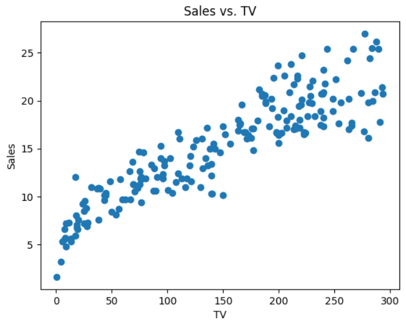
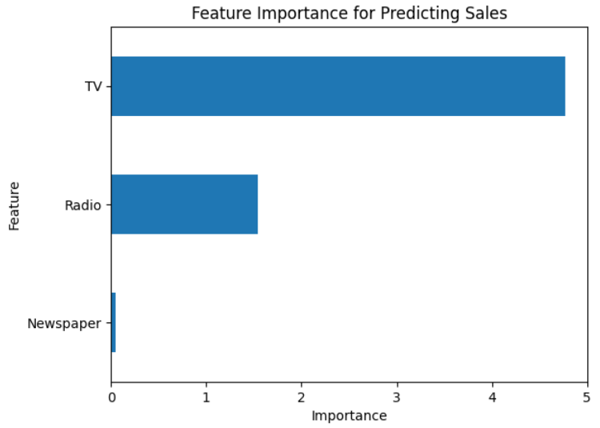

# Sales-Prediction

# Overview

A linear regression model to predict sales based on advertising costs which is a regression problem.

# Data Collection

Data has already available [here](https://www.kaggle.com/code/ashydv/sales-prediction-simple-linear-regression/input). The dataset has given advertising cost of `TV`, `Radio` and `Newspaper`. From this we have to predict the `Sales`.

# Data Preprocessing

Dataset didn't have any `NULL` or `Duplicate` values. Also didn't have any `Low-High Cardinality` or `Multicollinearity` problem.

# Model Training

Datasets is trained using `Linear Regression` as we have to predict the `Sales` from continuous features.

# Result Analysis
Our model should minimize the `Mean Absolute Error`.I
<table>
<thead>
    <tr>
      <th>Model</th>
      <th>Baseline MAE</th>
      <th>Training MAE</th>
      <th>Testing MAE</th>
    </tr>      
  </thead>
<tbody>
  <tr>
    <td>Logistic Regression</td>
    <td>4.55</td>
    <td>1.29</td>
    <td>1.26</td>
  </tr>
  </tbody>
</table>

We can see, our `Baseline MAE` was 4.55. Our model beat the `Baseline` model's performance and `Training MAE` becomes 1.29 which is further reduced to 1.26 in `Testing MAE`.

# Important Feature

From the image, we can see that `TV` has positive correlation with `Sales` which contributes the most to predict the `Sales`.

  
  
